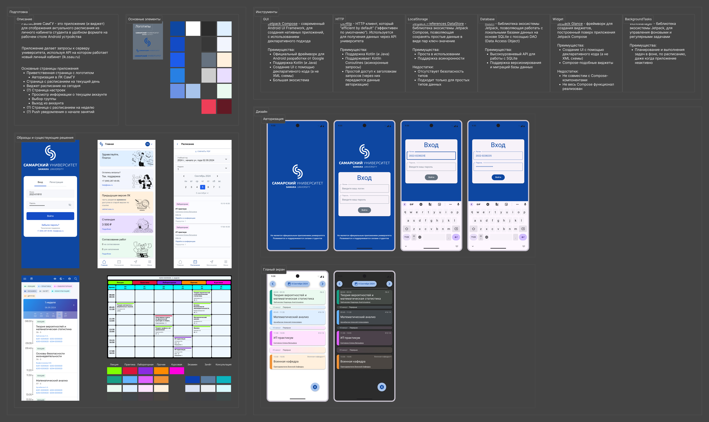

# Расписание СамГУ

> **Расписание СамГУ** - это нативное Android-приложение приложение, позволяющее студентам СамГУ просматривать своё учебное расписание в удобном формате на своём мобильном устройстве

## Функционал
- Приветственная страница с логотипом университета
- Форма входа в личный кабинет
  - Используется API официального сервера университета, поэтому для авторизации используется логин и пароль от [личного кабинета студента](https://lk.ssau.ru)
- Страница расписания по дням
  - Загрузка расписания в фоновом режиме создаёт эффект бесконечной прокрутки
- Использованы официальные цвета [личного кабинета студента](https://lk.ssau.ru)
- Виджет на экран рабочего стола с расписанием на ближайшую неделю
- Фоновый процесс обновляющий расписание и виджет каждые 3 часа

## Стэк
- **Android** (Nougat, API 24 и выше)
- **Kotlin**
- **[Jetpack Compose](https://developer.android.com/compose)**
  - [Material Design 3](https://m3.material.io/develop/android/jetpack-compose)
  - [DataStore](https://developer.android.com/topic/libraries/architecture/datastore) (хранение данных о пользователе)
  - [Room](https://developer.android.com/training/data-storage/room) ([DAO](https://ru.wikipedia.org/wiki/Data_Access_Object)-абстракция над [SQLite](https://www.sqlite.org), хранение расписания)
  - [Glance](https://developer.android.com/develop/ui/compose/glance) (создание виджетов)
  - [WorkManager](https://developer.android.com/develop/background-work/background-tasks/persistent) (управление фоновыми процессами)
- **[OkHttp](https://square.github.io/okhttp/)** (HTTP запросы)

## Дизайн
