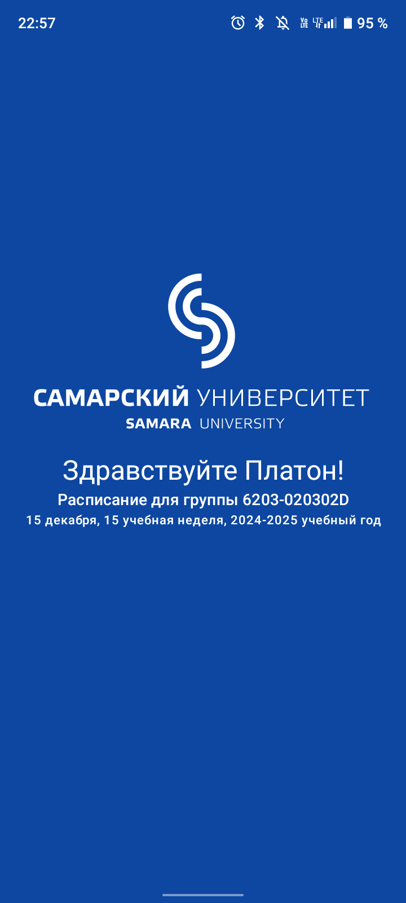
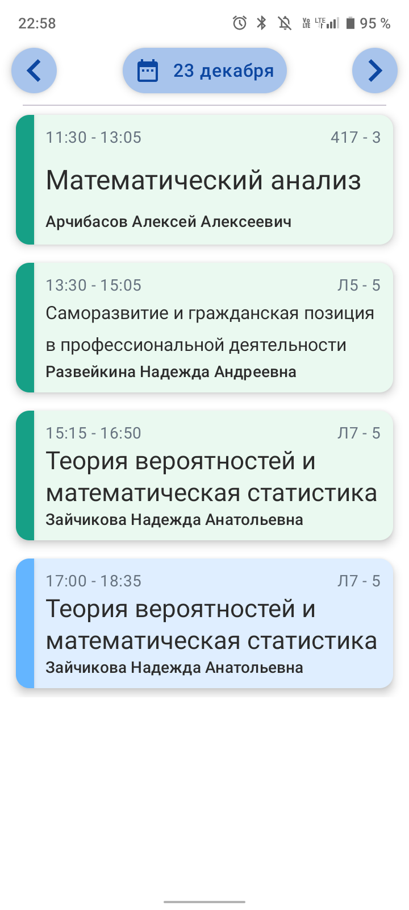
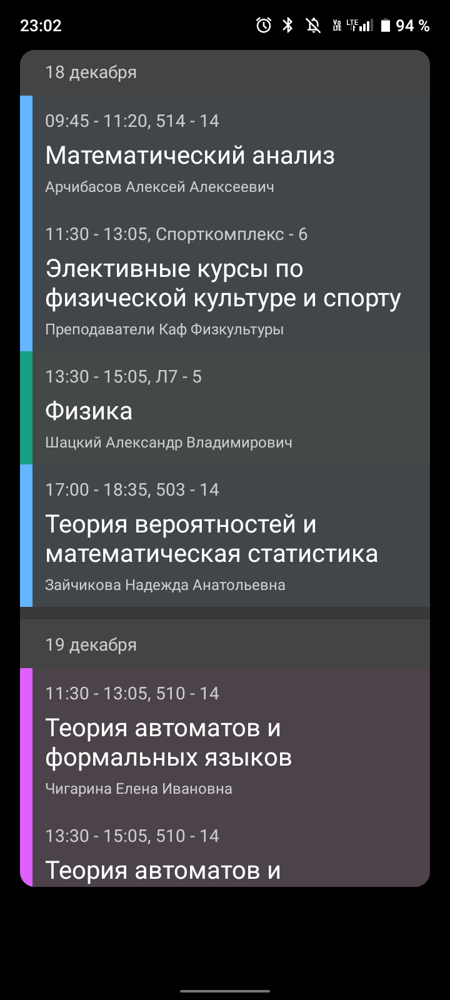
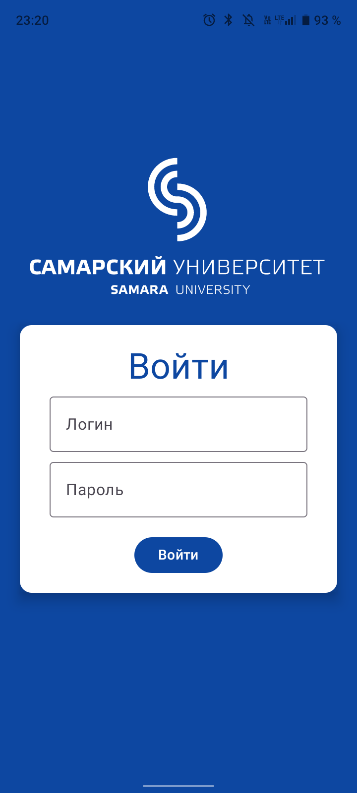
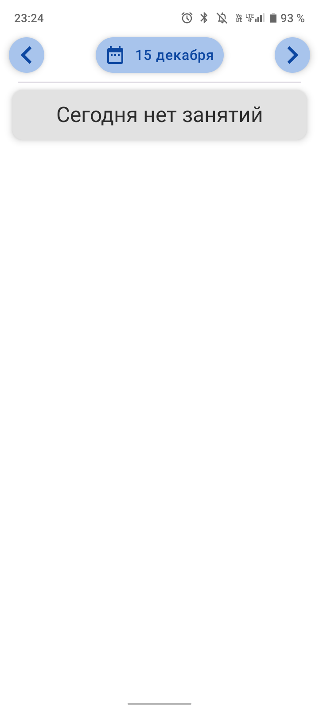
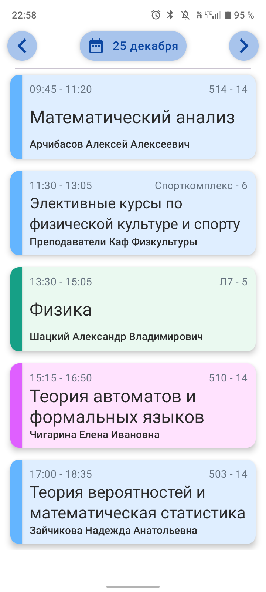
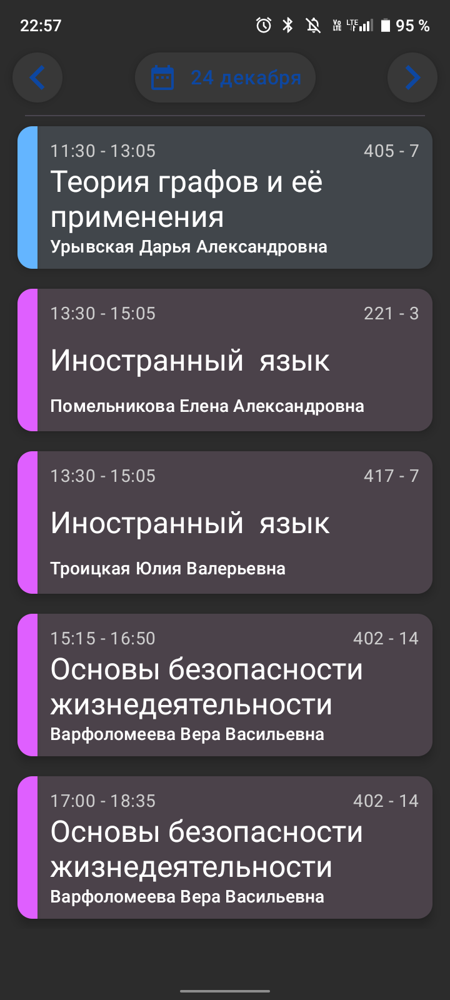

# Расписание СамГУ

> **Расписание СамГУ** - это нативное Android-приложение приложение, позволяющее студентам СамГУ просматривать своё учебное расписание в удобном формате на своём мобильном устройстве

|   |  |  |
|:-:|:-:|:-:|

## Функционал
- Приветственная страница с логотипом университета
- Форма входа в личный кабинет
  - Используется API официального сервера университета, поэтому для авторизации используется логин и пароль от [личного кабинета студента](https://lk.ssau.ru)
- Страница расписания по дням
  - Загрузка расписания в фоновом режиме создаёт эффект бесконечной прокрутки
- Использованы официальные цвета [личного кабинета студента](https://lk.ssau.ru)
- Виджет на экран рабочего стола с расписанием на ближайшую неделю
- Фоновый процесс обновляющий расписание и виджет каждые 3 часа

## Стэк
- **Android** (Nougat, API 24 и выше)
- **Kotlin**
- **[Jetpack Compose](https://developer.android.com/compose)**
  - [Material Design 3](https://m3.material.io/develop/android/jetpack-compose)
  - [DataStore](https://developer.android.com/topic/libraries/architecture/datastore) (хранение данных о пользователе)
  - [Room](https://developer.android.com/training/data-storage/room) ([DAO](https://ru.wikipedia.org/wiki/Data_Access_Object)-абстракция над [SQLite](https://www.sqlite.org), хранение расписания)
  - [Glance](https://developer.android.com/develop/ui/compose/glance) (создание виджетов)
  - [WorkManager](https://developer.android.com/develop/background-work/background-tasks/persistent) (управление фоновыми процессами)
- **[OkHttp](https://square.github.io/okhttp/)** (HTTP запросы)

## Дизайн
> Я не профессиональный дизайнер, но захотел провести некоторую предварительную работу перед разработкой. Посмотреть макет можно [по ссылке](https://www.figma.com/design/crUziAJNAyiJm5Pdz5jqSi/%D0%A0%D0%B0%D1%81%D0%BF%D0%B8%D1%81%D0%B0%D0%BD%D0%B8%D0%B5-%D0%A1%D0%B0%D0%BC%D0%93%D0%A3?node-id=291-502&t=3jUxs46eDvDQG2an-1) (хотя не факт, что она всё ещё рабочая). Итоговая версия несколько отличается от изначального дизайна. Пока не все запланированные функции реализованы

## Скриншоты
|   |  |  |
|:-:|:-:|:-:|
|  |  |   |

## To-Do и нереализованные идеи
- [ ] **Страница настроек**
  - [ ] Просмотр информации о текущей аккаунте
  - [ ] Выбор группы (для студентов, обучающихся на двух программах и более)
  - [ ] Выбор подгруппы
  - [ ] Выбор цветовой схемы (для приложения и для виджета)
    - [ ] Смена светлой и тёмной темы
    - [ ] Выбор цветового стиля для предметов (новый или старый стиль)
  - [ ] Выход из аккаунта
- [ ] **Страница с расписанием на неделю** (в горизонтальной ориентации)
- [ ] **Синхронизация с календарём**
- [ ] Отправка уведомлений за Х минут до начала занятий